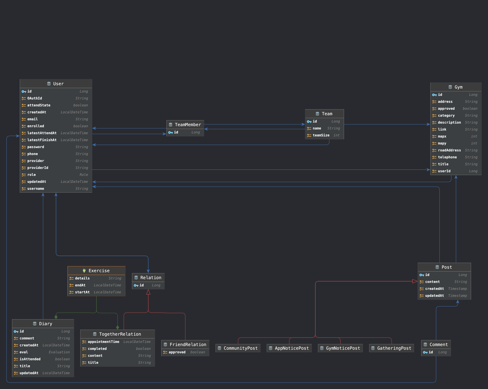

# 헬스장 커뮤니티 프로젝트

## 요구사항

### ✣ Security

- 회원가입 방식

	- UserRequestDto를 통해 json형식으로 객체를 받아 User 데이터베이스에 저장
	- OAuth2를 통해 인증된 사용자를 데이터 베이스에 저장

- Spring Security를 이용한 인증, 인가을 사용한다

	- JWT 토큰을 이용한 인증
	- JWT 토큰이 만기되면 재인증 필요
	- 헤더에 remember-me 를 true로 명시할 시 JWT 토큰이 만기되더라도 자동으로 새로운 JWT 토큰 발행 
	- 권한은 3단계로 구분한다(member, manager, admin)
		- member -> 일반 유저
		- manager -> 헬스장(업주) 등록한 유저
		- admin -> 모든 유저 관리(권한 승격 및 시설등록 등의 권한)

- Security Filter Chain(Authentication, Authorization)에서 예외 발생시  json 형식의 response 

	```json
	{
	  "code": "",
	  "message": "",
	  "detail": {
	    "field": "",
	    "reason": ""
	  }
	}
	```

	- Authentication -> AuthenticationFailureHandler 구현
	- Authorization -> AuthenticationEntrypoint 구현

[시큐리티 관련 세부 설정](https://github.com/zezeg2/gymcot/tree/main/src/main/java/com/example/gymcot/config)

### ✣ API 기능 요구사항

### User

UserRequestDto

```json
{
  "username": "",
  "phone": "",
  "password": "",
  "email": "",
  "attendState": false
}
```

UserResponseDto

```json
{
  "id": 0,
  "username": "",
  "phone": "",
  "email": "",
  "role": "ROLE_MEMBER",
  "attendState": false,
  "provider": "",
  "enrolled": false,
  "latestAttendAt": "2022-08-03 12:56:52",
  "latestFinishAt": "2022-08-03 12:56:52"
}
```

Role -> Enum 클래스로 구현

- UserApiController(Interface)

  - 공동으로 사용하는 의존성 주입
  - 공동으로 사용하는 메서드 정의 -> Authentication 객체로 부터 user_id를 가져올 수 있도록

- CommonController(/) : 권한에 관계없이  공통으로 사용하는 API

  | url      | authorization | Description | method | parameter      | return         |
  | -------- | ------------- | ----------- | ------ | -------------- | -------------- |
  | "/", "." | ALL           | 테스트용    | get    | -              | String "index" |
  | "/join"  | AlLL          | 회원가입    | post   | UserRequestDto | void           |

- MemberApiController("/api/v1/member") : Member 권한을 가지고 있는 User에 대한 컨트롤러

  - Manager권한으로 approve상태 변경

  | url            | authorization | Description               | method | parameter                                 | return          |
  | -------------- | ------------- | ------------------------- | ------ | ----------------------------------------- | --------------- |
  | "/"            | ALL           | Member 정보 업데이트      | put    | Authentication                            | void            |
  | "/"            | ALL           | Member 정보 가져오기(Dto) | get    | Authentication                            | UserResponseDto |
  | "/gym/{gymId}" | ALL           | 헬스장 등록               | put    | Authentication<br />PathVariable : gym_id | void            |
  | "/attend"      | ALL           | 출석 상태 변경            | put    | Authentication                            | void            |
  | "delete"       | ALL           | 회원 탈퇴                 | delete | Authentication                            | void            |

  

- ManagerApiController ("/api/v1/manager") :  Manager 권한을 가지고 있는 User에 대한 컨트롤러  

  - Admin 권한으로 approve상태 변경

  | url                           | authorization | Description                                                  | method | parameter                                   | return                |
  | ----------------------------- | ------------- | ------------------------------------------------------------ | ------ | ------------------------------------------- | --------------------- |
  | "/"                           | Manager       | Manager 정보 업데이트                                        | put    | Authentication                              | void                  |
  | "/"                           | Manager       | Manager 정보 가져오기(Dto)                                   | get    | Authentication                              | UserResponseDto       |
  | "/approve-member/{username}"" | Manager       | 자신의 헬스장에 등록한 User의 enrolled 필드 수정             | put    | Authentication<br />PathVariable : username | void                  |
  | "/expel-member/{username}"    | Manager       | 자신의 헬스장에 등록한 User의 gym 필드, enrolled필드 수정 -> 강제 탈퇴 기능 | put    | Authentication<br />PathVariable : username | void                  |
  | "/waiting-list"               | Manager       | 자신의 헬스장에 등록했으나 승인되지 않은 유저의 리스트       | get    | Authentication                              | List<UserResponseDto> |
  | "/enrolled-user-list"         | Manager       | 자신의 헬스장에 등록 하고 승인된 유저의 리스트               | get    | Authentication                              | List<UserResponseDto> |
  | "delete"                      | Manager       | 회원 탈퇴                                                    | delete | Authentication                              | void                  |

  

- AdminApiController ("/api/v1/admin") : Admin 권한을 가지고 있는 User에 대한 컨트롤러

  | url                      | authorization | Description                | method | parameter                                   | return                |
  | ------------------------ | ------------- | -------------------------- | ------ | ------------------------------------------- | --------------------- |
  | "/"                      | Admin         | Admin 정보 업데이트        | put    | Authentication                              | void                  |
  | "/"                      | Admin         | Admin 정보 가져오기(Dto)   | get    | Authentication                              | UserResponseDto       |
  | "/cr/{username}/{role}"" | Admin         | User의 권한 변경           | put    | Authentication<br />PathVariable : username | void                  |
  | "/managers"              | Admin         | Manager 권한의 유저 리스트 | get    | Authentication                              | List<UserResponseDto> |
  | "delete"                 | Admin         | admin 계정 삭제            | delete | Authentication                              | void                  |

### GymController ("/api/v1/gym") : 헬스장 관련 기능 API

GymRequestController 

```json
{
  "title": "",
  "link": "",
  "category": "",
  "description": "",
  "telephone": "",
  "address": "",
  "roadAddress": "",
  "mapx": 0,
  "mapy": 0
}
```

GymResponseController

```json
{
  "id": 0,
  "title": "",
  "link": "",
  "category": "",
  "description": "",
  "telephone": "",
  "address": "",
  "roadAddress": "",
  "mapx": 0,
  "mapy": 0
}
```

| url                 | authorization | Description                                                  | method | parameter                                  | return               |
| ------------------- | ------------- | ------------------------------------------------------------ | ------ | ------------------------------------------ | -------------------- |
| "/"                 | ALL           | 네이버 API를 이용한 장소(헬스장) 검색                        | get    | RequestParam : String(헬스장 이름)         | List<GymResponseDto> |
| "/all_list"         | ALL           | Admin으로부터 등록된 헬스장 리스트                           | get    | -                                          | List<GymResponseDto> |
| "/my_gym"           | Member        | 자신이 다니는 헬스장 정보                                    | get    | Authentication                             | GymResponseDto       |
| "/enroll"           | Manager       | 헬스장 추가                                                  | post   | Authentication, GymRequestDto              | void                 |
| "/update"           | Manager       | 헬스장 정보 업데이트                                         | put    | Authentication, GymRequestDto              | void                 |
| "/pre-enrolled"     | Admin         | 관리자 권한으로 승인되지 않은 헬스장 리스트                  | get    | Authentication                             | List<GymResponseDto> |
| "/approve/{gym_id}" | Admin         | 관리자가 헬스장을 승인하는 기능                              | put    | Authentication<br />PathVariable : gym_id  | void                 |
| "/delete/{gym_id}"  | Admin         | 관리자가 헬스장을 삭제하는 기능                              | delete | Authentication<br />PathVariable : gym_id  | void                 |
| "/enrolled"         | ALL           | 등록된 모든 헬스장 리스트                                    | get    | -                                          | List<GymResponseDto> |
| "/search"           | ALL           | 헬스장 명, 주소, 도로명주소로 검색하여 리스트로 가져오는 기능 | get    | RequsetParam : title, address, roadAddress | List<GymResponseDto> |


### RelationController ("/api/v1/member/relation") : 친구관계 혹은 같이 운동하기 관계 기능 API

- FriendRelation, TogetherRelation(Entity) 이 각각 Relation을 상속(inheritancetype : SingleTable)하여 하나의 테이블로 구성

- RelationRequestDto

	```json
	{
	  "dtype": "",
	  "title": "",
	  "toUsername": "",
	  "approved": false,
	  "startAt": "2022-08-03 13:48:23",
	  "endAt": "2022-08-03 13:48:23",
	  "appointmentTime": "2022-08-03 13:48:23",
	  "detail": {}
	}
	```

- RelationResponseDto

	```json
	{
	  "id": 0,
	  "title": "",
	  "content": "",
	  "appointmentTime": "2022-08-03 13:48:39",
	  "startAt": "2022-08-03 13:48:39",
	  "endAt": "2022-08-03 13:48:39",
	  "fromUsername": "",
	  "approved": false,
	  "exercise": {
	    "startAt": "2022-08-03 13:48:39",
	    "endAt": "2022-08-03 13:48:39",
	    "details": ""
	  }
	}
	```
	| url                            | authorization | Description                   | method | parameter                                                    | return                    |
	| ------------------------------ | ------------- | ----------------------------- | ------ | ------------------------------------------------------------ | ------------------------- |
	| "/{dtype}"                     | Member        | 친구/ 같이하기 관계 생성      | post   | Authentication, RelationRequestDto,<br />PathVariable : String dtype | void                      |
	| /together-start/{relation_id}" | Member        | 같이하기 시작시간 설정        | put    | Authentication<br />PathVariable : String relation_id        | void                      |
	| "/together-end/{relation_id}"  | Member        | 같이하기 종료시간 설정        | put    | Authentication<br />PathVariable : String relation_id        | void                      |
	| "/friend/approve/{username}"   | Member        | 친구요청 승인                 | put    | Authentication<br />PathVariable : String username           | void                      |
	| "/friend/approved/list"        | Member        | 승인된 친구목록               | get    | Authenticatoin                                               | List<RelationResponseDto> |
	| "/friend/waiting/list"         | Member        | 승인 전 친구목록              | get    | Authenticatoin                                               | List<RelationResponseDto> |
	| "/together/list/{completed}"   | Member        | 같이하기 목록(완료 혹은 이전) | get    | Authentication<br />PathVariable : String username           | List<RelationResponseDto> |
	| "/friend/delete/{username}"    | Member        | 친구 삭제                     | delete | Authentication<br />PathVariable : String username           | void                      |
	| "/together/delete/{username}"  | Member        | 같이하기 삭제                 | delete | Authentication<br />PathVariable : String username           | void                      |
	
	### DiaryController ("/api/v1/member/diary") : User의  운동기록 관리 관련 API
	
	DiaryReausetDto
	
	```json
	{
	  "eval": "COOL",
	  "targets": [
	    "AEROBIC"
	  ],
	  "startAt": "2022-08-03 15:11:03",
	  "endAt": "2022-08-03 15:11:03",
	  "detail": {},
	  "comment": ""
	}
	```
	
	DiaryResponseDto
	
	```json
	{
	  "eval": "COOL",
	  "exercise": {
	    "startAt": "2022-08-03 15:11:30",
	    "endAt": "2022-08-03 15:11:30",
	    "details": ""
	  },
	  "comment": "",
	  "isAttended": false,
	  "createdAt": "2022-08-03 15:11:30",
	  "updatedAt": "2022-08-03 15:11:30"
	}
	```
	
	Target, Evaluation -> Enum 클래스로 구현
	
	Exercise -> Diary Entity에 Embeded
	
	| url                 | authorization | Description                  | method | parameter                                                    | return                |
	| ------------------- | ------------- | ---------------------------- | ------ | ------------------------------------------------------------ | --------------------- |
	| "/"                 | Member        | 다이어리 생성                | post   | Authentication, DiaryRequestDto                              | void                  |
	| "/today"            | Member        | 오늘 날짜 다이어리 조회      | get    | Authentication                                               | DiaryReausetDto       |
	| "/{unit}"           | Member        | 주, 월, 년단위 다이어리 조회 | get    | Authentication<br />PathVariable : String unit               | List<DiaryReausetDto> |
	| "/calender/{month}" | Member        | 특정  월의 다이어리 조회     | get    | Authentication<br />PathVariable : Integer month<br />RequestParam : Integer year | List<DiaryReausetDto> |
	| "when/{date}"       | Member        | 특정 날짜의 다이어리 조회    | get    | Authentication <br />PathVariable : LocalDate date(pattern = "yyyy-MM-dd") | DiaryReausetDto       |
	| "/eval/{grade}"     | Member        | 금일 활동 평가               | put    | Authentication<br />PathVariable : String grade              | void                  |
	| "/delete"           | Member        | 다이어리 삭제                | delete | Authentication                                               | void                  |


### Entity 관계도 (ER Diagram & 클래스 상속관계)


